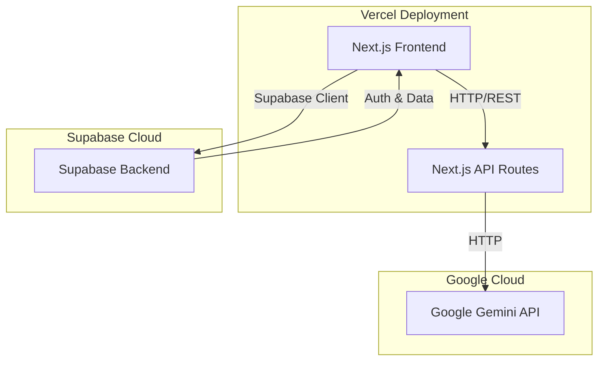

# Design Document

## Overview

The Home Energy Usage Tracker is a full-stack web application built with Next.js 14 (App Router), Supabase for backend services, and Google Gemini for AI-powered insights. The architecture follows a modern serverless approach with clear separation between frontend presentation, backend data management, and AI processing.

The application uses a single-page application (SPA) pattern with server-side rendering for optimal performance and SEO. User authentication is handled by Supabase Auth with JWT tokens, and all data operations enforce row-level security to ensure privacy.

## Architecture

### High-Level Architecture



### Technology Stack

- **Frontend Framework**: Next.js 14 with App Router
- **UI Library**: React 18
- **Styling**: TailwindCSS 3.x
- **Charts**: Recharts
- **Authentication**: Supabase Auth
- **Database**: Supabase (PostgreSQL)
- **AI**: Google Gemini API (@google/generative-ai)
- **Notifications**: react-hot-toast
- **Deployment**: Vercel (frontend), Supabase Cloud (backend)

### Application Structure

```
/app
  /auth
    /login
      page.tsx          # Login page
    /signup
      page.tsx          # Signup page
  /dashboard
    page.tsx            # Main dashboard with charts and insights
    layout.tsx          # Protected route layout
  /api
    /insights
      route.ts          # AI insights generation endpoint
  layout.tsx            # Root layout
  page.tsx              # Landing/home page

/components
  Chart.tsx             # Recharts wrapper for energy visualization
  EnergyForm.tsx        # Form for adding/editing readings
  EnergyList.tsx        # List of energy readings with edit/delete
  StatCard.tsx          # Display statistics (total, average)
  InsightsCard.tsx      # Display AI-generated insights
  AuthForm.tsx          # Reusable auth form component
  Navbar.tsx            # Navigation bar
  Toast.tsx             # Toast notification wrapper

/lib
  supabaseClient.ts     # Supabase client initialization
  geminiClient.ts       # Gemini API client
  types.ts              # TypeScript type definitions
  utils.ts              # Utility functions (date formatting, calculations)

/hooks
  useEnergyReadings.ts  # Custom hook for CRUD operations
  useAuth.ts            # Custom hook for authentication state
```

## Components and Interfaces

### Frontend Components

#### 1. Authentication Components

**AuthForm.tsx**
- Props: `mode: 'login' | 'signup'`
- Handles email/password input with validation
- Calls Supabase Auth methods
- Displays error messages
- Redirects to dashboard on success

**useAuth.ts Hook**
```typescript
interface UseAuth {
  user: User | null;
  loading: boolean;
  signUp: (email: string, password: string) => Promise<void>;
  signIn: (email: string, password: string) => Promise<void>;
  signOut: () => Promise<void>;
}
```

#### 2. Dashboard Components

**EnergyForm.tsx**
- Props: `onSubmit: (reading: EnergyReading) => void, initialData?: EnergyReading, mode: 'create' | 'edit'`
- Form fields: date picker, utility type dropdown, usage number input, notes textarea
- Client-side validation (future dates, negative values)
- Displays validation errors inline

**EnergyList.tsx**
- Props: `readings: EnergyReading[], onEdit: (id: string) => void, onDelete: (id: string) => void`
- Displays readings in a table or card layout (responsive)
- Edit and delete buttons per row
- Confirmation dialog for delete operations

**Chart.tsx**
- Props: `data: EnergyReading[], type: 'line' | 'bar', utilityFilter?: string, dateRange?: DateRange`
- Uses Recharts library
- Filters data based on props
- Responsive chart sizing
- Color-coded by utility type (electricity: yellow, gas: blue, water: cyan)

**StatCard.tsx**
- Props: `title: string, value: number, unit: string, icon?: ReactNode`
- Displays a single statistic with styling
- Used for total usage, average usage, etc.

**InsightsCard.tsx**
- Props: `insights: string, loading: boolean`
- Displays AI-generated text
- Shows loading spinner while fetching
- Refresh button to regenerate insights

#### 3. Custom Hooks

**useEnergyReadings.ts**
```typescript
interface UseEnergyReadings {
  readings: EnergyReading[];
  loading: boolean;
  error: Error | null;
  addReading: (reading: Omit<EnergyReading, 'id' | 'user_id' | 'created_at'>) => Promise<void>;
  updateReading: (id: string, reading: Partial<EnergyReading>) => Promise<void>;
  deleteReading: (id: string) => Promise<void>;
  refetch: () => Promise<void>;
}
```

### Backend Components

#### 1. Supabase Client

**supabaseClient.ts**
```typescript
import { createClient } from '@supabase/supabase-js';

export const supabase = createClient(
  process.env.NEXT_PUBLIC_SUPABASE_URL!,
  process.env.NEXT_PUBLIC_SUPABASE_ANON_KEY!
);
```

#### 2. API Routes

**/api/insights/route.ts**
- Method: POST
- Request body: `{ energyData: EnergyReading[] }`
- Validates user authentication via Supabase JWT
- Formats data for Gemini prompt
- Calls Gemini API with structured prompt
- Returns: `{ insights: string, recommendations: string[] }`
- Error handling for API failures

**Gemini Prompt Structure**:
```
Analyze the following household energy usage data:
[JSON data with dates, types, and usage values]

Provide:
1. A 2-3 sentence summary of recent trends (increases, decreases, patterns)
2. Three specific, actionable recommendations for reducing energy consumption

Format the response as natural, friendly language suitable for homeowners.
```

## Data Models

### Database Schema

**Table: energy_readings**

```sql
CREATE TABLE energy_readings (
  id UUID PRIMARY KEY DEFAULT uuid_generate_v4(),
  user_id UUID REFERENCES auth.users(id) NOT NULL,
  date DATE NOT NULL,
  type TEXT NOT NULL CHECK (type IN ('electricity', 'gas', 'water')),
  usage NUMERIC(10, 2) NOT NULL CHECK (usage >= 0),
  notes TEXT,
  created_at TIMESTAMPTZ DEFAULT NOW(),
  updated_at TIMESTAMPTZ DEFAULT NOW()
);

-- Index for efficient queries
CREATE INDEX idx_energy_readings_user_date ON energy_readings(user_id, date DESC);
CREATE INDEX idx_energy_readings_user_type ON energy_readings(user_id, type);

-- Row Level Security
ALTER TABLE energy_readings ENABLE ROW LEVEL SECURITY;

CREATE POLICY "Users can view own readings"
  ON energy_readings FOR SELECT
  USING (auth.uid() = user_id);

CREATE POLICY "Users can insert own readings"
  ON energy_readings FOR INSERT
  WITH CHECK (auth.uid() = user_id);

CREATE POLICY "Users can update own readings"
  ON energy_readings FOR UPDATE
  USING (auth.uid() = user_id);

CREATE POLICY "Users can delete own readings"
  ON energy_readings FOR DELETE
  USING (auth.uid() = user_id);

-- Trigger for updated_at
CREATE OR REPLACE FUNCTION update_updated_at_column()
RETURNS TRIGGER AS $$
BEGIN
  NEW.updated_at = NOW();
  RETURN NEW;
END;
$$ LANGUAGE plpgsql;

CREATE TRIGGER update_energy_readings_updated_at
  BEFORE UPDATE ON energy_readings
  FOR EACH ROW
  EXECUTE FUNCTION update_updated_at_column();
```

### TypeScript Interfaces

```typescript
// lib/types.ts

export interface EnergyReading {
  id: string;
  user_id: string;
  date: string; // ISO date string
  type: 'electricity' | 'gas' | 'water';
  usage: number;
  notes?: string;
  created_at: string;
  updated_at: string;
}

export interface User {
  id: string;
  email: string;
  created_at: string;
}

export interface DateRange {
  start: string; // ISO date string
  end: string;   // ISO date string
}

export interface ChartDataPoint {
  date: string;
  electricity?: number;
  gas?: number;
  water?: number;
}

export interface Statistics {
  totalElectricity: number;
  totalGas: number;
  totalWater: number;
  avgElectricity: number;
  avgGas: number;
  avgWater: number;
  periodDays: number;
}

export interface AIInsights {
  summary: string;
  recommendations: string[];
  generatedAt: string;
}
```

## Error Handling

### Frontend Error Handling

1. **Authentication Errors**
   - Invalid credentials: Display "Invalid email or password" message
   - Network errors: Display "Unable to connect. Please try again."
   - Session expired: Redirect to login with message

2. **Form Validation Errors**
   - Display inline error messages below each field
   - Prevent form submission until all errors resolved
   - Validation rules:
     - Date: Cannot be in future
     - Usage: Must be positive number
     - Type: Must be one of three options

3. **API Errors**
   - CRUD operations: Display toast notification with error message
   - AI insights: Display "Unable to generate insights. Please try again later."
   - Retry mechanism for transient failures (max 2 retries)

4. **Chart Rendering Errors**
   - Empty data: Display "No data available for selected period"
   - Invalid data: Log error, display fallback message

### Backend Error Handling

1. **Supabase Errors**
   - Connection failures: Return 503 Service Unavailable
   - Authentication failures: Return 401 Unauthorized
   - Permission errors: Return 403 Forbidden
   - Validation errors: Return 400 Bad Request with details

2. **Gemini API Errors**
   - Rate limiting: Return 429 with retry-after header
   - API key invalid: Log error, return 500 Internal Server Error
   - Timeout (>10s): Cancel request, return 504 Gateway Timeout
   - Invalid response: Log error, return generic insights

3. **Error Logging**
   - Log all errors to console in development
   - Use structured logging in production (consider Vercel Analytics)
   - Include: timestamp, user_id, error type, stack trace

## Testing Strategy

### Unit Testing

**Tools**: Jest, React Testing Library

**Components to Test**:
- EnergyForm: Validation logic, form submission
- Chart: Data transformation, filtering
- useEnergyReadings hook: CRUD operations with mocked Supabase
- useAuth hook: Authentication flows with mocked Supabase
- Utility functions: Date formatting, statistics calculations

**Test Coverage Goals**: >80% for utility functions and hooks

### Integration Testing

**Tools**: Playwright or Cypress

**Flows to Test**:
1. Complete user journey: Sign up → Add reading → View chart → Get insights → Log out
2. CRUD operations: Create → Edit → Delete reading
3. Filtering: Apply date range and utility type filters
4. Error scenarios: Invalid login, network failures

### API Testing

**Tools**: Jest with node-fetch or supertest

**Endpoints to Test**:
- /api/insights: Valid request, invalid data, authentication failures
- Mock Gemini API responses for consistent testing

### Manual Testing Checklist

- [ ] Responsive design on mobile (375px), tablet (768px), desktop (1920px)
- [ ] Cross-browser compatibility (Chrome, Firefox, Safari, Edge)
- [ ] Accessibility: Keyboard navigation, screen reader compatibility
- [ ] Performance: Page load <3s, chart rendering <1s
- [ ] Security: RLS policies enforced, no data leakage between users

### Testing Approach

- **Test-After Development**: Implement features first, then write tests to validate
- **Focus on Critical Paths**: Prioritize testing authentication, data persistence, and AI integration
- **Mock External Services**: Use mocked Supabase and Gemini clients for faster, reliable tests
- **Continuous Testing**: Run tests on every commit via CI/CD pipeline

## Security Considerations

1. **Authentication**
   - Use Supabase Auth with secure JWT tokens
   - Implement CSRF protection via Supabase client
   - Store tokens in httpOnly cookies (Supabase default)

2. **Authorization**
   - Enforce row-level security on all database operations
   - Validate user_id matches authenticated user on all API routes
   - Never expose other users' data in API responses

3. **Input Validation**
   - Sanitize all user inputs before database insertion
   - Validate data types and ranges on both client and server
   - Prevent SQL injection via Supabase parameterized queries

4. **API Security**
   - Store API keys in environment variables (never commit)
   - Use server-side API routes to hide Gemini API key
   - Implement rate limiting on /api/insights endpoint (consider Vercel rate limiting)

5. **Data Privacy**
   - Encrypt data in transit (HTTPS)
   - Supabase encrypts data at rest by default
   - Comply with data retention policies (allow user data deletion)

## Performance Optimization

1. **Frontend**
   - Use Next.js App Router for automatic code splitting
   - Implement React.memo for Chart and StatCard components
   - Lazy load InsightsCard component
   - Optimize images with Next.js Image component
   - Use TailwindCSS JIT for minimal CSS bundle

2. **Backend**
   - Index database queries on user_id and date
   - Implement pagination for large datasets (>100 readings)
   - Cache AI insights for 1 hour to reduce API calls
   - Use Supabase connection pooling

3. **API**
   - Set timeout for Gemini API calls (10s max)
   - Implement request debouncing for insights generation
   - Consider edge functions for faster response times

## Deployment Strategy

1. **Environment Variables**
   ```
   NEXT_PUBLIC_SUPABASE_URL=
   NEXT_PUBLIC_SUPABASE_ANON_KEY=
   GEMINI_API_KEY=
   ```

2. **Vercel Deployment**
   - Connect GitHub repository to Vercel
   - Configure environment variables in Vercel dashboard
   - Enable automatic deployments on main branch
   - Use preview deployments for pull requests

3. **Supabase Setup**
   - Create project in Supabase dashboard
   - Run database migration scripts
   - Configure authentication providers (email/password)
   - Set up row-level security policies
   - Enable realtime subscriptions (optional for future features)

4. **Post-Deployment**
   - Verify authentication flow
   - Test CRUD operations
   - Validate AI insights generation
   - Monitor error logs and performance metrics
